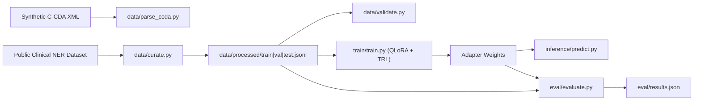

# clinical-ner-finetune

A recruiter-friendly proof-of-concept clinical NLP pipeline that demonstrates:
- LLM fine-tuning with QLoRA/PEFT
- clinical dataset curation for instruction tuning
- healthcare XML (C-CDA style) + JSON parsing
- PyTorch + Hugging Face engineering
- scikit-learn splitting and evaluation
- unit and integration testing with pytest
- data quality validation for scientific/clinical workflows

## Recruiter Signal Snapshot
- Built and debugged an end-to-end clinical NER fine-tuning workflow on Colab T4.
- Implemented reproducible public-dataset curation with fallback loading and schema normalization.
- Added robust validation and metrics utilities (including edge-case handling for zero-class slices).
- Shipped tested, CLI-first Python modules suitable for portfolio review.

## Project Overview
This repository is intentionally simple and modular. It focuses on practical end-to-end workflow clarity rather than production hardening or aggressive optimization.

The pipeline:
1. Parse one synthetic C-CDA XML example.
2. Curate a public clinical/biomedical NER dataset into a normalized extraction schema.
3. Validate processed JSONL quality.
4. Fine-tune a compact instruct model (default: Phi-3 Mini) with QLoRA.
5. Run inference for demo notes.
6. Evaluate held-out extraction quality.

## Technical Requirements
- Python 3.10+
- Hugging Face Transformers
- PEFT
- TRL
- Datasets
- PyTorch
- scikit-learn
- xmltodict and/or lxml
- pytest

## Why This Matters for Clinical AI
Healthcare AI projects often fail because data curation and quality controls are under-specified. This POC emphasizes:
- reproducible dataset transformations,
- explicit schema normalization,
- traceable quality checks,
- and practical model adaptation workflows that run in constrained environments (e.g., Colab T4).

## Architecture Flow


## Repository Structure
```text
clinical-ner-finetune/
├── README.md
├── requirements.txt
├── .gitignore
├── data/
│   ├── raw/
│   │   └── sample_ccda.xml
│   ├── interim/
│   ├── processed/
│   ├── parse_ccda.py
│   ├── curate.py
│   └── validate.py
├── train/
│   ├── train.py
│   └── config.yaml
├── eval/
│   ├── evaluate.py
│   └── results.json
├── inference/
│   └── predict.py
├── tests/
│   ├── test_parse_ccda.py
│   ├── test_curate.py
│   ├── test_validate.py
│   └── test_evaluate.py
├── notebooks/
│   └── clinical_ner_finetune_colab.ipynb
└── assets/
    ├── architecture.png
    └── sample_results.png
```

## Dataset Curation Pipeline
`data/curate.py` provides a reproducible curation flow:
- loads public dataset using fallback order:
  - `medical_ner`
  - `ncbi_disease`
  - `bc5cdr`
- normalizes text with `clean_note(...)`
- maps source labels to target extraction schema:
  - `problems`
  - `treatments`
  - `tests`
- filters weak examples with `is_valid_example(...)`
- formats instruction-style chat data with `format_example(...)`
- splits train/val/test with scikit-learn `train_test_split`
- exports JSONL files for SFT training

The repository includes tiny placeholder `data/processed/*.jsonl` files for immediate smoke testing. Replace them by running `data/curate.py` on a public dataset.

### Target Training Example Format
```json
{
  "messages": [
    {"role": "system", "content": "You are a clinical NLP model. Extract named medical entities and return valid JSON."},
    {"role": "user", "content": "Clinical note:\n..."},
    {"role": "assistant", "content": "{\"problems\": [...], \"treatments\": [...], \"tests\": [...]}"}
  ]
}
```

## XML / C-CDA Parsing Note
`data/parse_ccda.py` intentionally parses only a minimal synthetic C-CDA-like structure:
- `ClinicalDocument/component/structuredBody/component/section`
- extracts section `title` + `text`

This is deliberate: the goal is format awareness and parser hygiene, not full C-CDA standard coverage.

## Training Setup
`train/train.py` uses:
- PyTorch
- Hugging Face Transformers
- 4-bit quantization (`bitsandbytes`)
- PEFT LoRA adapters
- TRL `SFTTrainer`

Default base model: `microsoft/Phi-3-mini-4k-instruct`

### Colab T4-Friendly Defaults
- small per-device batch size
- gradient accumulation
- practical sequence length
- 1 epoch baseline
- adapter-only output artifacts

## PyTorch + Hugging Face Fine-Tuning Approach
1. Load curated train/val JSONL.
2. Render `messages` into chat-formatted text.
3. Load base model in 4-bit mode.
4. Attach LoRA modules for parameter-efficient adaptation.
5. Fine-tune via supervised instruction format.
6. Save adapter + tokenizer for inference/evaluation.

## scikit-learn Usage (Explicit)
This project uses scikit-learn for:
- `train_test_split` in curation (`data/curate.py`)
- precision/recall/F1 utilities in evaluation (`eval/evaluate.py`), including multilabel binarization.

## Data Quality Checks
`data/validate.py` performs:
- JSONL parse checks
- required `messages` schema checks
- role presence checks (`system`, `user`, `assistant`)
- assistant payload JSON checks
- target-key checks (`problems`, `treatments`, `tests`)
- malformed row counts
- empty-output counts
- entity distribution stats
- average note length reporting

Validation exits non-zero if invalid rows exceed threshold.

### Latest Local Validation Snapshot (March 10, 2026)
- Dataset loaded by curation pipeline: `bc5cdr` (fallback from `medical_ner`/`ncbi_disease`)
- Curated examples: `500`
- Split sizes: `400` train / `50` val / `50` test
- Validation rows checked: `500`
- Invalid rows: `0`
- Entity counts: `problems=2547`, `treatments=1802`, `tests=0`
- Average note length: `1305.33` characters

## Quickstart
For a one-cell Colab workflow, use [notebooks/COLAB_QUICKSTART.md](/Users/dante/Projects/Clinical NER Fine-Tuning/clinical-ner-finetune/notebooks/COLAB_QUICKSTART.md).

### 1. Install dependencies
```bash
python -m venv .venv
source .venv/bin/activate
pip install -r requirements.txt
```

### 2. Parse synthetic C-CDA sample
```bash
python data/parse_ccda.py \
  --input_xml data/raw/sample_ccda.xml \
  --output_txt data/interim/parsed_ccda.txt
```

### 3. Curate dataset into train/val/test JSONL
```bash
python data/curate.py \
  --output_dir data/processed \
  --dataset_preference medical_ner,ncbi_disease,bc5cdr \
  --seed 42
```
If `medical_ner` is unavailable, the script automatically falls back to `ncbi_disease` and then `bc5cdr`.

### 4. Validate processed data
```bash
python data/validate.py --input_glob "data/processed/*.jsonl"
```

### 5. Fine-tune with QLoRA
```bash
python train/train.py --config train/config.yaml
```

### 6. Run inference
```bash
python inference/predict.py \
  --base_model microsoft/Phi-3-mini-4k-instruct \
  --adapter_dir outputs/phi3-clinical-ner/adapter \
  --note "Patient has COPD and was started on tiotropium. Pulmonary function test ordered."
```

### 7. Evaluate held-out set
```bash
python eval/evaluate.py \
  --test_file data/processed/test.jsonl \
  --base_model microsoft/Phi-3-mini-4k-instruct \
  --adapter_dir outputs/phi3-clinical-ner/adapter \
  --output_file eval/results.json
```

### 8. Run tests
```bash
pytest -q
```

## Example Inference Output
```json
{
  "problems": ["copd"],
  "treatments": ["tiotropium"],
  "tests": ["pulmonary function test"]
}
```

## Inference Screenshot
Use this command to regenerate a screenshot-friendly inference run:
```bash
python inference/predict.py \
  --base_model microsoft/Phi-3-mini-4k-instruct \
  --adapter_dir outputs/phi3-clinical-ner/adapter \
  --note "Patient with diabetes on metformin. HbA1c ordered."
```

Sample terminal-style inference capture:


Screenshot asset path:
- `assets/sample_results.png`

## Results Table (Adapter Run)
| Metric | Value |
|---|---:|
| Test Precision (problems+treatments) | 0.8000 |
| Test Recall (problems+treatments) | 0.7515 |
| Test F1 (problems+treatments) | 0.7750 |
| Exact Match Rate | 0.5500 |

Latest run details:
- Evaluated examples: `80`
- Base model: `microsoft/Phi-3-mini-4k-instruct`
- Predictor: `adapter`
- Label-specific notes: `problems` has support 165 and F1 0.775; `treatments` support was 0 in this split, so treatment metrics are 0.0.

## Reproducibility Notes
- Default random seed: `42`
- Deterministic split path: `data/curate.py`
- Colab T4 practical settings are provided in `train/config.yaml`
- Full metrics depend on runtime, model download availability, and dataset availability

## Limitations
- C-CDA parser is intentionally minimal and non-comprehensive.
- Entity schema is simplified to `problems`, `treatments`, `tests`.
- Label mapping from public datasets is heuristic.
- This is a POC and does not include clinical safety, privacy, or production monitoring controls.

## Future Improvements
- Add stricter ontology mapping (SNOMED/LOINC/RxNorm alignment).
- Add stronger entity-level scoring (span overlap + normalization variants).
- Add GPT or rule-based baseline in `eval/` for side-by-side benchmarking.
- Expand C-CDA parser coverage for additional sections and coding systems.
- Add experiment tracking and richer error analysis notebooks.
